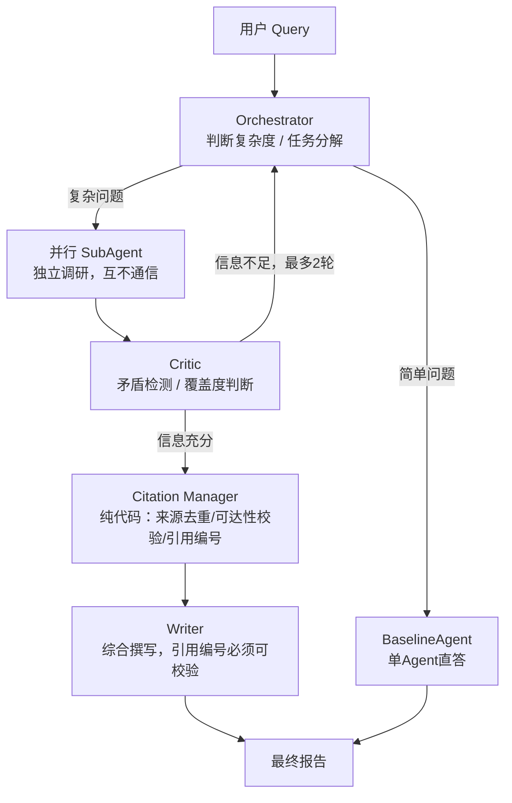

# DeepResearch-MAS

多智能体协同的深度研究系统：输入一个开放性研究问题，系统自动判断复杂度，按需拆解成并行子任务调研、交叉验证、来源核查，产出带引用编号的结构化报告，支持迭代反思与追问。

参考架构：Anthropic《[How we built our multi-agent research system](https://www.anthropic.com/engineering/multi-agent-research-system)》的 Orchestrator-Worker 模式，在此基础上补强了预算控制、幻觉防护、Prompt Injection 防御、可观测性和评估体系。

> 这是一个工程实践/求职作品项目，不是生产系统。README 和 [`docs/design_decisions_log.md`](docs/design_decisions_log.md) 如实记录了包括失败案例在内的全部真实数据，没有为了好看而省略代价或未解决的问题。

---

## 架构



星型拓扑（hub-and-spoke）：SubAgent 之间不直接通信，所有信息经 Orchestrator 中转，写入显式的 `ResearchState`——避免 N 个 agent 互相通信产生的 O(N²) 消息路径，代价是 Orchestrator 可能成为瓶颈，这是有意识接受的权衡。

## 核心特性

- **复杂度自适应路由**：简单问题直接单 agent 回答，不为了"看起来高级"启动全套流程
- **并行调研 + 反思闭环**：Critic 检测跨子任务矛盾、判断覆盖度，信息不足打回 Orchestrator 补充调研（硬编码最多 2 轮）
- **三层防幻觉**：SubAgent 层无来源不可断言 → Citation Manager 用代码做 URL 可达性校验 → Writer 引用编号必须可核验，查不到触发重写，重写仍失败则代码强制清洗
- **Prompt Injection 三层防护**：关键词预过滤 + `<tool_result>` 结构化隔离 + prompt 显式声明，均有真实对抗测试验证
- **三维预算熔断**：token / 工具调用次数 / 墙钟时间任一超限，强制收敛而不是无限重试
- **工具调用级实时可观测性**：FastAPI + WebSocket，SubAgent 每次搜索都实时推送到前端，不是黑盒
- **安全的报告渲染**：Markdown → HTML 经 `bleach` 白名单清洗后展示，防止 LLM 生成内容里潜在的 XSS

## 技术栈

| 层 | 选型 |
|---|---|
| 编排 | LangGraph（StateGraph + 条件边） |
| API 服务 | FastAPI + WebSocket |
| LLM | DeepSeek-V4-Pro / V4-Flash，经 Anthropic 兼容接口接入 |
| 搜索 | Tavily API |
| 报告渲染 | markdown + bleach |
| 部署 | Docker + docker-compose（含 Qdrant，当前版本尚未接入应用逻辑） |

## 快速开始

```bash
# 1. 安装依赖
python -m venv .venv
.venv/Scripts/activate   # Windows；Linux/Mac 用 source .venv/bin/activate
pip install -r requirements.txt

# 2. 配置 API Key
cp .env.example .env
# 编辑 .env，填入 DEEPSEEK_API_KEY 和 TAVILY_API_KEY

# 3. 启动
uvicorn app.api.main:app --reload --port 8000
```

打开 `http://localhost:8000`，输入研究问题即可体验。也可以用 `docker-compose up --build`（Dockerfile/compose 文件按标准写法编写，**尚未在开发环境实测**，见「已知限制」）。

## 项目结构

```
app/
├── agents/        # Orchestrator / SubAgent / Critic / Writer / BaselineAgent
├── graph/          # ResearchState 定义 + LangGraph 图构建
├── tools/          # 纯代码工具：web_search / citation_manager / report_render
├── infra/          # 预算控制 / 可观测性 / 模型路由 / Prompt Injection规则
└── api/            # FastAPI 入口 + WebSocket
frontend/            # 单文件静态页面，无构建步骤
eval/                # 评估脚本 + LLM-as-judge + 对比报告
docs/                # 架构设计文档 + 逐milestone的设计决策日志
tests/                # unit（mock LLM）+ integration（真实API对抗测试）
```

## 评估结果

18 题评估集，M1 单 agent baseline vs 完整多 agent 系统的真实对比（详见 [`eval/comparison_report.md`](eval/comparison_report.md)）：

| 维度 | M1 Baseline | 完整系统 |
|---|---|---|
| accuracy (0-5) | 3.50 | 4.44 |
| completeness (0-5) | 3.33 | 4.17 |
| citation_validity (0-5) | 3.22 | 4.44 |
| honesty (0-5) | 3.56 | 4.78 |
| 总 token 消耗 | 65,728 | 250,663（3.81倍） |
| 平均单题延迟 | 58.2s | 159.2s（2.73倍） |
| 超时/失败题目数 | 5/18 | 0/18 |

质量提升是真实的，成本代价也是真实的——多 agent 不是免费的质量提升，是用可控的额外成本换取了广度优先问题上的正确性和完整性。

## 测试

```bash
pytest tests/unit -q          # 88个单元测试，全部mock LLM调用，快速跑
pytest tests/integration -q   # 5个对抗测试，真实调用API，验证幻觉防护/注入防护是否真的生效
```

## 已知限制

如实列出，不掩盖：

- 部分子任务在信息量大、网络负载高时仍会超时（见 `docs/design_decisions_log.md` M5 章节 eval-018 案例）
- Writer 综合超大规模 findings（40+条）时可能触发降级为结构化列表而非叙述性报告
- Orchestrator 复杂度路由准确率稳定在 72%-78%，在当前评估集规模下容易过拟合
- `docker-compose up` 未在开发环境实测（未安装 Docker）
- Qdrant 已预置容器但应用代码尚未接入，长期记忆/历史复用能力未实现
- 任务状态存进程内存，不支持多进程部署，服务重启会丢失进行中的任务

## 文档索引

- [`docs/01_架构设计方案.md`](docs/01_架构设计方案.md) —— 完整架构设计与权衡讨论
- [`docs/design_decisions_log.md`](docs/design_decisions_log.md) —— **最重要**，按 milestone 记录每一步真实测试数据、设计决策、发现并修复的真实 bug
- [`docs/06_Demo演示脚本.md`](docs/06_Demo演示脚本.md) —— 演示用的问题示例
- [`PROGRESS.md`](PROGRESS.md) —— milestone 完成情况总览
